Data communications network technologies are generally conceptualized using a "multi layer" model in which "upper" layer services are hosted-on/transported-by "lower" layer services.  The dominant conceptual model for networking technology is the OSI 7-layer model, in which the second and third layers are the data link layer" and "network layer", respectively.  An overwhelming majority of the networks deployed in contemporary enterprise IT networkse utilize the Internet Protocol ("IP") and Ethernet as their layer-3 and layer-2 services.  These network services utilize a concept called the "maximum transmission unit" ("MTU") to describe the maximum support datagram size on their respective networks.

The following diagram visually depicts the relationship of IP and Ethernet to each other, with an IP protocol packet being "encapsulated" into a surrounding Ethernet frame.  It's important to note that both protocols/formats have their own "payload" and "header" sections, which contribute to their overall length.  The "payload" is the data that each protocol accepts from the immediately-upper-layer service.  The "header" is the protocol's own data.

[{:class="img-fluid"}](./pages/1/2%20(mtu-manifesto)/mtu-mani-diag-1.drawio.svg){:target="_blank"}

The following diagram depicts the same IP/Ethernet encapsulation relationship, in a jumbo frame-enabled Ethernet environment.  Note that the maximum available Layer3/IP payload has increased from 1440-bytes to 8800-bytes in a jumbo-frame-enabled Ethernet environment.

[{:class="img-fluid"}](./pages/1/2%20(mtu-manifesto)/mtu-mani-diag-2.drawio.svg){:target="_blank"}

